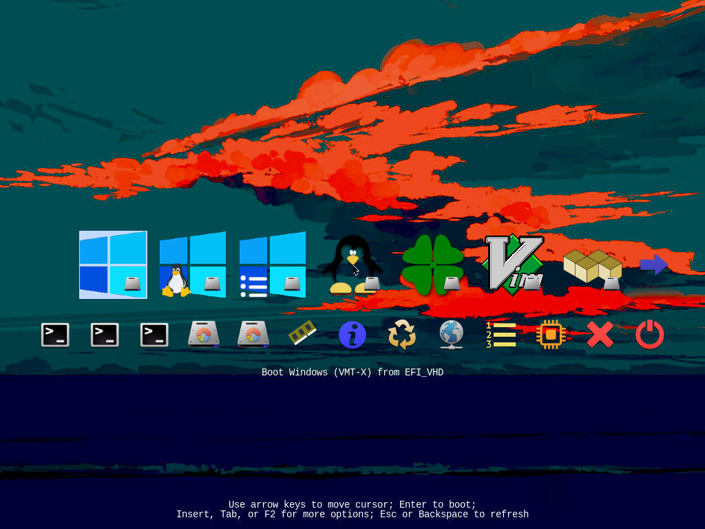
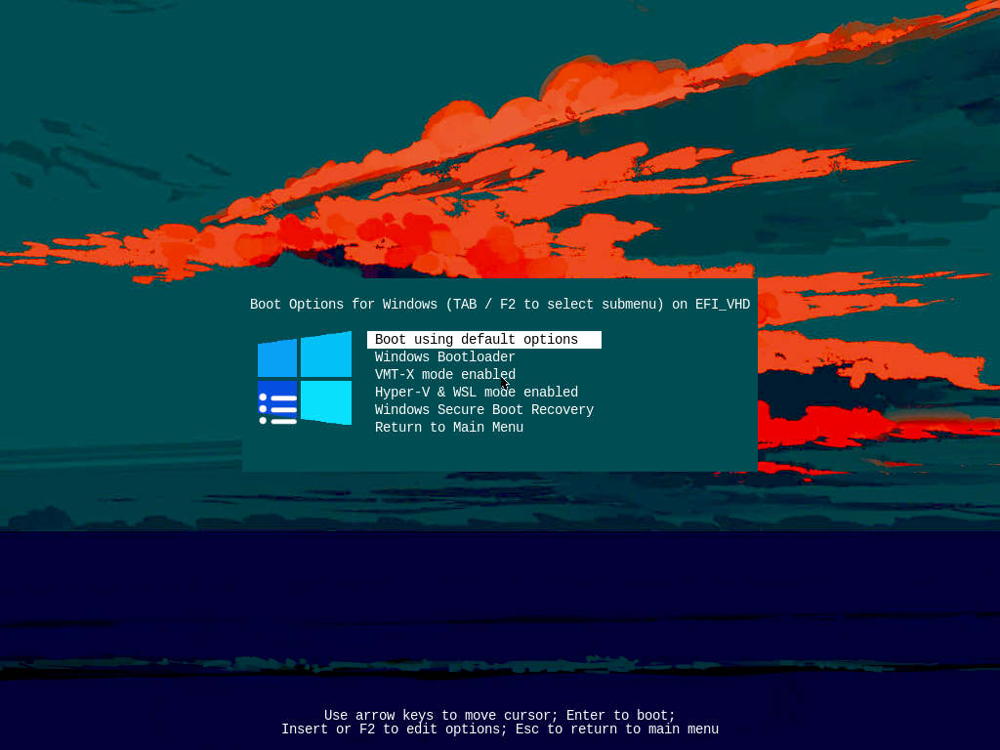
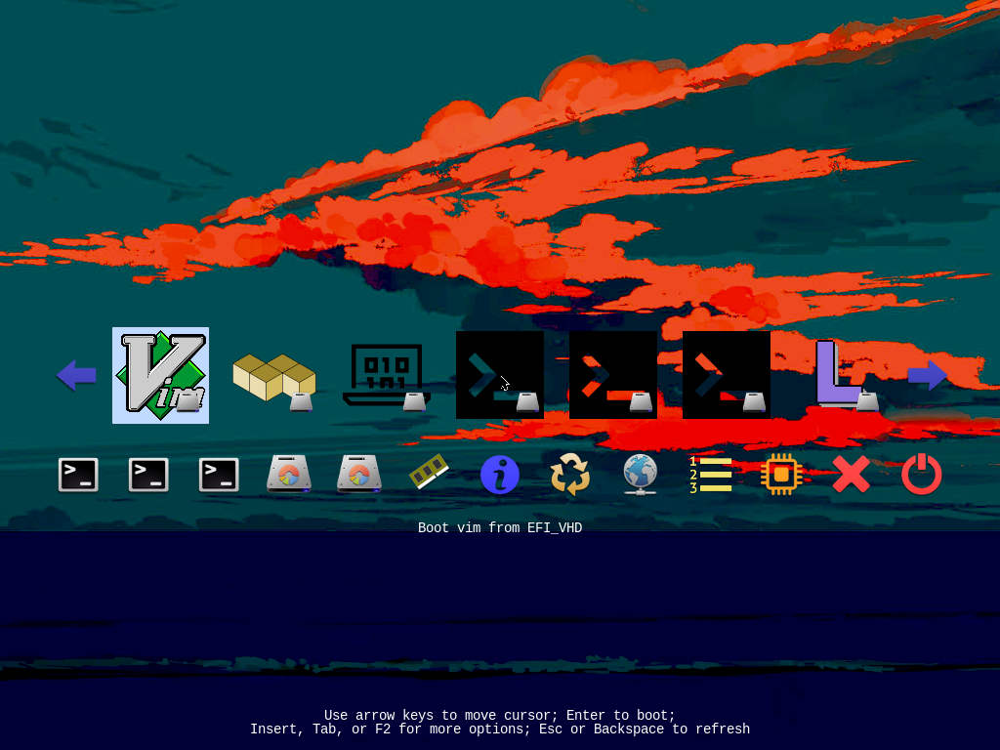
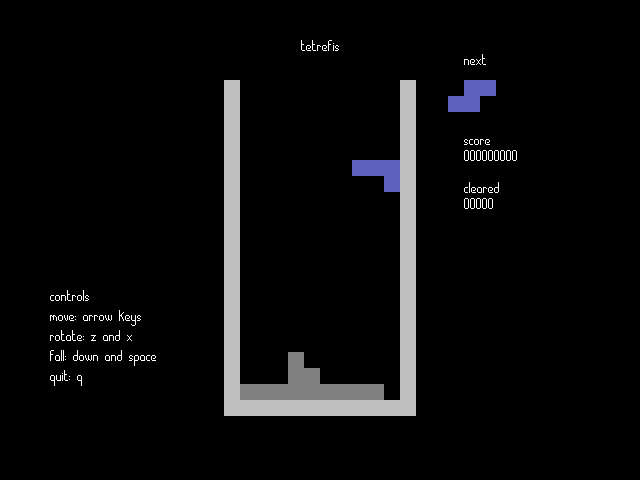

# awesome-uefi

### Description
A repository for UEFI related settings and apps.

Includes my own EFI partition configuration with rEFInd bootloader, (extra limine and clover bootloaders), Windows BCD boot and some (un)necessary UEFI apps.

### Warning!
Broken EFI means boot problems. Take a backup of your EFI partition. And don't blame me if you break your system. Secure Boot? I don't know her.

### Files

- TODO - add filelist.md with descriptions.

### Screenshots

